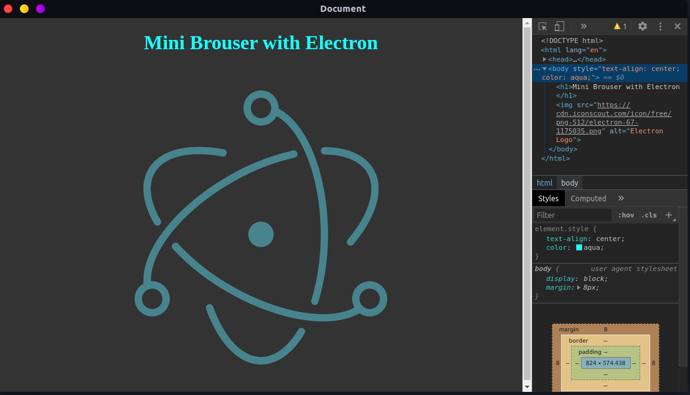

# Mini Browser with Electron

## Table of Contents

- [About](#about)
- [Getting Started](#getting_started)
- [Usage](#usage)
- [Contributing](../CONTRIBUTING.md)

## About <a name = "about"></a>

This project is a Mini Browser developed with Electron. This mini browser serves as a tool for people who need a simple browser that cannot be minimized or overlapped by another application, and still has the web development tool.



## Getting Started <a name = "getting_started"></a>

This application is started from the command line, so it needs some previous installations.

### Prerequisites

- [NodeJS](https://nodejs.org/en/)
- [Git](https://git-scm.com/)

### Installing

First step is to clone this repository

```sh
git clone https://github.com/victorradael/MiniBrowserWithElectron.git
```

Step two, open the cloned folder with the command terminal and run the following command:

```sh
npm install
```

## Usage <a name = "usage"></a>

After the previous steps, to execute the application in a desired way, define the URL that should be initialized in the config.js file.

```javascript
module.exports = {
  url: "url here",
};
```

then, still inside the cloned folder, just execute the command:

```sh
npm start
```

Once this is done the application will start, to end it just use the command **Ctrl+C** on Windows or **Cmd+C** on Mac, and to use the developer tool the shortcut is e **Cmd or Ctrl + J**.
